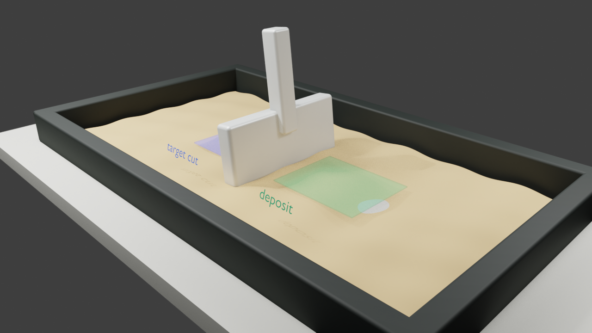
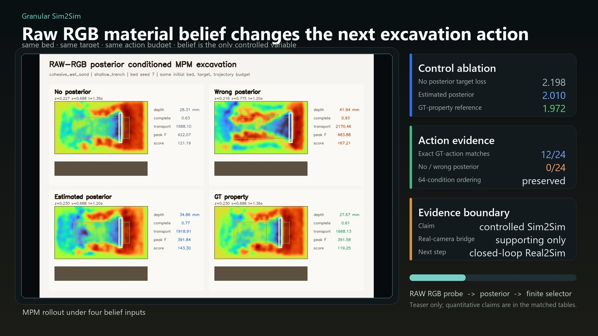

<h1 align="center">Granular Sim2Sim</h1>

<p align="center">
  <b>Online material belief for finite-budget granular excavation</b>
</p>

<p align="center">
  <a href="https://rachy103.github.io/Granular_Sim2Sim/"><b>Project Page</b></a> |
  <a href="docs/assets/papers/granular_sim2sim_draft.pdf"><b>Draft PDF</b></a> |
  <a href="#main-result"><b>Main Result</b></a> |
  <a href="docs/reproducibility.md"><b>Reproduce</b></a>
</p>

<p align="center">
  <a href="https://github.com/rachy103/Granular_Sim2Sim"></a>
  
  
  
  
</p>

| Interaction View | Height-Map / Belief View |
| --- | --- |
| <a href="docs/assets/videos/blender_interaction_teaser.mp4"></a> | <a href="docs/assets/videos/raw_rgb_posterior_teaser.mp4"></a> |
| A cinematic 3D view of the same tray-scale interaction. | The research signal: raw RGB probe -> material posterior -> selected excavation action. |

This repo studies a bounded question:

> If a robot briefly probes a granular material, can the resulting material belief help it choose a better excavation action under the same target, bed, and action budget?

The current answer is a controlled Sim2Sim result, not a deployed real-robot excavation claim. The draft paper and project page make that boundary explicit.

## Start Here

- **Project page:** [rachy103.github.io/Granular_Sim2Sim](https://rachy103.github.io/Granular_Sim2Sim/)
- **Draft paper:** [docs/assets/papers/granular_sim2sim_draft.pdf](docs/assets/papers/granular_sim2sim_draft.pdf)
- **Main teaser:** [docs/assets/videos/raw_rgb_posterior_teaser.mp4](docs/assets/videos/raw_rgb_posterior_teaser.mp4)
- **Interaction render:** [docs/assets/videos/blender_interaction_teaser.mp4](docs/assets/videos/blender_interaction_teaser.mp4)

## Main Result

All rows use the same initial sand bed, target trench, and finite action budget. Only the controller belief changes.

| Controller belief | Target loss down | Depth completion | Force violation down | Strict success | GT action match |
| --- | ---: | ---: | ---: | ---: | ---: |
| No posterior | 2.198 | 1.19 | 446 N | 2/24 | 0/24 |
| Wrong posterior | 2.629 | 0.59 | 2852 N | 0/24 | 0/24 |
| Estimated posterior | **2.010** | 1.03 | 420 N | **5/24** | **12/24** |
| GT property reference | 1.972 | 0.98 | 338 N | 2/24 | 24/24 |

The GT-property row is a finite-selector material-input reference, not a global oracle. The key result is that the estimated posterior moves the selected finite action toward the GT-property action and improves the target metric over no posterior and wrong posterior.

## What Is Being Tested

The main pipeline is intentionally simple and auditable:

1. Render or observe a short material-probe interaction.
2. Convert raw RGB frames into a material posterior over granular parameters.
3. Pass the posterior mean into a material-conditioned finite action selector.
4. Compare the resulting MPM excavation rollout against no posterior, wrong posterior, and GT-property reference settings.

The project page also includes supporting checks for shuffled posteriors, held-out materials, appearance shift, force-dominant settings, and DDBot-core-style target height fields.

## Evidence Boundary

| Item | Evidence in this repo | Not claimed |
| --- | --- | --- |
| Control | Matched MPM ablations under shared targets and beds | Real-robot excavation deployment |
| Vision | Raw procedural RGB probe sequences | Real-camera video closed-loop transfer |
| Real pixels | Static soil RGB bridge checks | Real excavation control from real images |
| Force | Force/torque modality audits | Hidden wrench use in the main RGB-only result |
| DDBot | Scoped DDBot-core-style stress test | Full official DDBot superiority |

## Repository Map

```text
docs/                            GitHub Pages site, videos, figures, draft PDF
docs/assets/videos/              Browser-playable project videos
docs/assets/figures/             Paper and project-page figures
docs/assets/papers/              Public discussion draft
experiments/ddbot_posterior_heightfield_mpc/
                                 Scoped DDBot-core-style benchmark artifacts
paper_draft/arxiv_paper/         Local paper workspace
scripts/                         Project-page media and render utilities
src/granular_robot/              Reusable package code
```

## Local Preview

To preview the project page locally:

```bash
python -m http.server 8000 -d docs
```

Then open `http://localhost:8000`.

## Install

The tested path is WSL2/Linux with an NVIDIA CUDA-capable GPU, but compact Warp smoke paths can run on CPU.

```bash
git clone https://github.com/rachy103/Granular_Sim2Sim.git
cd Granular_Sim2Sim

chmod +x install.sh
./install.sh --locked
```

For a lighter CPU-oriented install:

```bash
./install.sh --lite --no-menagerie
```
