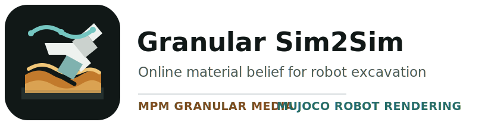
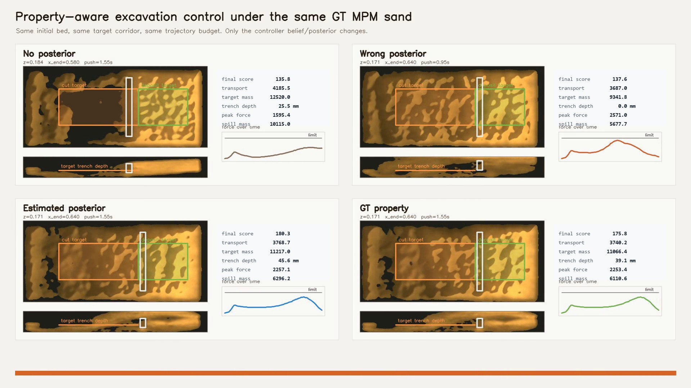

<p align="center">
  
</p>

<h1 align="center">Granular Sim2Sim</h1>

<p align="center">
  <b>Online material belief for robot excavation in granular media</b>
</p>

<p align="center">
  <a href="https://rachy103.github.io/Granular_Sim2Sim/">Project Page</a> |
  <a href="docs/wild_material_robustness_paper.md">Paper Draft</a> |
  <a href="docs/reviewer_audit.md">Reviewer Audit</a> |
  <a href="docs/reproducibility.md">Reproducibility</a>
</p>

<p align="center">
  <a href="https://github.com/rachy103/Granular_Sim2Sim"></a>
  
  
  
  
</p>

<p align="center">
  <video src="docs/assets/videos/property_aware_mpm_excavation.mp4" poster="docs/assets/posters/property_aware_mpm_excavation.jpg" width="860" controls muted loop playsinline></video>
</p>

<p align="center">
  <a href="docs/assets/videos/property_aware_mpm_excavation.mp4">
    
  </a>
</p>

<p align="center">
  <b>Main theme:</b> short interaction → material posterior → safer excavation action.
  Same GT MPM sand and blade geometry, with controller belief ablated.
</p>

This repository is a reproducible sandbox for Sim2Sim granular robot interaction.
It estimates granular material family and Mohr-Coulomb-style properties online
from MPM deformation, robot wrench, and end-effector kinematics, then uses the
posterior in downstream excavation and validation tasks.

The current claim is deliberately scoped: synthetic Sim2Sim robustness across
gravel, sand, soil, and crunching debris under held-out actions, held-out
materials, overlapping property ranges, and sensor/vision corruptions. Real2Sim
transfer is the next step, not a current claim.

## Catalog

- [What This Repo Contains](#what-this-repo-contains)
- [Environment](#environment)
- [Quick Reproduction](#quick-reproduction)
- [Training And Inference](#training-and-inference)
- [Render And Evaluation Artifacts](#render-and-evaluation-artifacts)
- [Repository Layout](#repository-layout)
- [Artifact Policy](#artifact-policy)
- [Citation](#citation)

## What This Repo Contains

- A compact 3D Warp MLS-MPM granular engine with SDF blade interaction.
- MuJoCo/Franka rendering paths for end-effector-over-density visualizations.
- Online material posterior estimation for four material families and physical
  properties.
- Sim2Sim validation tasks that make material differences visible, including
  bulldozing-wedge probing and property-aware excavation.
- A posterior-conditioned excavation ablation in the same GT MPM sand bed:
  no posterior, wrong posterior, estimated posterior, and GT property reference.
- Scoped DDBot-style target digging and real force/torque sanity checks.
- A mini research proposal for construction-site granular digital twins.
- A stress benchmark plus reviewer audit for leakage, modality dependence, and
  calibration checks.
- A GitHub Pages project site under `docs/`.

Headline stress result:

| Metric | Value |
| --- | ---: |
| Family accuracy | 0.931 |
| Worst-family accuracy | 0.877 |
| Mean property nMAE | 0.082 |
| Coverage error | 0.046 |

Main downstream control result:

| Controller belief | Trench depth | Depth completion | Peak force | Force violation | Score |
| --- | ---: | ---: | ---: | ---: | ---: |
| No posterior | 25.5 mm | 0.36 | 1595 N | 0 N | 135.8 |
| Wrong posterior | 0.0 mm | 0.00 | 2571 N | 0 N | 137.6 |
| Estimated posterior | 45.6 mm | 0.65 | 2257 N | 0 N | 180.3 |
| GT property reference | 39.1 mm | 0.56 | 2253 N | 0 N | 175.8 |

The GT property row is an oracle controller reference under the same finite
trajectory budget, not a global optimum. The estimated posterior result means
the belief was good enough to select a GT-level action from the sampled
candidate set.

## Environment

The tested path is WSL2/Linux with an NVIDIA CUDA-capable GPU, but the compact
Warp smoke paths can run on CPU. The installer creates `.venv`, installs the
package with MuJoCo, Newton, learning, and test extras, shallow-clones
`google-deepmind/mujoco_menagerie`, and runs import tests.

```bash
git clone https://github.com/rachy103/Granular_Sim2Sim.git
cd Granular_Sim2Sim

chmod +x install.sh
./install.sh --locked
```

The reference lock is `constraints/reference-linux-py310-cu128.txt`. It is a
WSL2/Linux Python 3.10 CUDA reference file. On other platforms, use the normal
installer if CUDA-specific wheels cannot be resolved:

```bash
./install.sh
```

For a lighter CPU-oriented install:

```bash
./install.sh --lite --no-menagerie
```

## Quick Reproduction

Fast source check:

```bash
make smoke
```

Use GPU for the same smoke path:

```bash
GRANULAR_SMOKE_DEVICE=cuda:0 make smoke
```

Rebuild the canonical project-page artifacts:

```bash
make property-aware-mpm
make ddbot-core-force
make aalto-real-force
make render-density-eef
make sim2sim-wedge
make excavation-policy
make wild-robustness-stress
make wild-review-audit
```

Build a compact demo bundle:

```bash
make demo
python scripts/package_demo_artifacts.py
```

The full source/asset/artifact contract is in
[`docs/reproducibility.md`](docs/reproducibility.md).

## Training And Inference

Train the online Mohr-Coulomb belief model in quick mode:

```bash
python scripts/train_online_mohr_coulomb.py --quick --output-dir outputs/online_mohr_coulomb_bestval_quick
```

The canonical quick result restores the best validation checkpoint before export
and writes:

```text
outputs/online_mohr_coulomb_bestval_quick/rollout_predictions.csv
```

Run a Latin-hypercube material/action sweep:

```bash
python scripts/run_property_sweep.py --config configs/sweeps/lhs_property_sweep.json
```

Run the hostile four-family robustness benchmark:

```bash
make wild-robustness-stress
```

## Render And Evaluation Artifacts

Render the fixed density-plus-MuJoCo-end-effector view with posterior and GT
bands:

```bash
make render-density-eef
```

Compare GT granular properties against estimated properties in the same
bulldozing-wedge probing task:

```bash
make sim2sim-wedge
```

Compare a fixed no-model excavation policy against a property-aware policy:

```bash
make excavation-policy
```

Run the main posterior-conditioned MPM excavation ablation:

```bash
make property-aware-mpm
```

Run the scoped DDBot-core force-posterior comparison:

```bash
make ddbot-core-force
```

Run the public real force/torque material-classification sanity check:

```bash
make aalto-real-force
```

Canonical outputs:

```text
experiments/property_aware_mpm_excavation/assets/mpm_posterior_control_ablation.mp4
experiments/property_aware_mpm_excavation/assets/mpm_posterior_control_summary.png
experiments/ddbot_core_force_posterior_benchmark/assets/ddbot_core_vs_force_posterior.mp4
experiments/ddbot_core_force_posterior_benchmark/assets/ddbot_core_force_posterior_summary.png
experiments/aalto_real_force_classification/results/aalto_summary_accuracy.png
experiments/aalto_real_force_classification/results/aalto_prefix_accuracy.png
outputs/density_mujoco_eef_render/density_mujoco_eef_property_overlay.mp4
outputs/sim2sim_bulldozing_wedge/sim2sim_bulldozing_wedge.mp4
outputs/excavation_policy_compare/excavation_policy_compare.mp4
outputs/wild_material_robustness_stress/
outputs/wild_review_audit/
```

Browser-ready copies for the project page are committed under:

```text
docs/assets/videos/
docs/assets/posters/
docs/assets/figures/
```

Project-page videos are H.264/yuv420p/faststart encoded so GitHub Pages can play
them reliably in Chromium, Safari, and Firefox.

## Repository Layout

```text
configs/                         Versioned experiment and rendering configs
docs/                            Project page, paper draft, audit, reproducibility docs
docs/assets/                     Page videos, posters, figures, and logo assets
scripts/                         Entry points for demos, training, rendering, packaging
src/granular_mpm/                MPM kernels, solvers, visualization, learning helpers
tests/                           Import, smoke, and behavior checks
outputs/                         Generated local artifacts, ignored by git
dist/                            Packaged artifact bundles, ignored by git
```

## Artifact Policy

Large generated files are reproducible artifacts, not source. The repo does not
track `outputs/`, `dist/`, `mujoco_menagerie/`, virtual environments, caches, or
heavy USD/PLY debug exports.

Use this command to make a shareable local bundle with videos, previews, logs,
configs, and a SHA-256 manifest:

```bash
python scripts/package_demo_artifacts.py
```

Use Git LFS only for assets that cannot be regenerated and must live inside git
history. The current robot assets are fetched from the pinned Menagerie commit in
`configs/external_assets.json`, so they stay outside git.

## Citation

```bibtex
@misc{granularsim2sim2026,
  title  = {Granular Sim2Sim: Online Material Belief for Robot Excavation},
  author = {Rachy103 and contributors},
  year   = {2026},
  url    = {https://github.com/rachy103/Granular_Sim2Sim}
}
```
