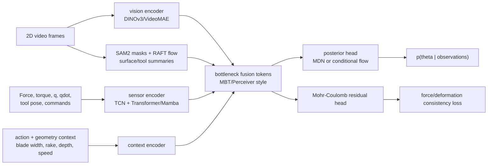

# Multimodal Mohr-Coulomb Inference Architecture

This note designs the next learning stack for blade digging interactions in
granular media. The target is a posterior over four Mohr-Coulomb-style soil
parameters from synchronized 2D vision and robot sensor streams.

The current repository already has a force-only baseline: `TemporalMDN` consumes
windows shaped `N x T x 12` from 6D wrench plus end-effector pose and velocity,
then predicts `phi_deg` and `cohesion_kpa`. That baseline is valuable as a
control, but it is not enough for the requested task because it omits 2D visual
deformation, joint state, action geometry, and explicit soil-mechanics
constraints.

## Target Parameters

Use a configurable target registry, with this excavation-first default:

```text
theta = [
  rho,        # bulk density
  phi,        # soil-soil/internal friction angle
  delta,      # tool-soil interface friction angle
  c,          # cohesion
]
```

This choice follows automated excavation literature that identifies density,
tool-soil friction angle, soil-soil friction angle, and cohesion as the unknown
soil parameters required for real-time soil-tool interaction force prediction
with a Mohr-Coulomb-based model.

If the experiment uses a simulation-material definition instead of a classical
excavation force definition, the same architecture should swap the registry to:

```text
theta = [E, nu, phi, c]
```

Keep the target registry explicit in every dataset manifest so that results are
not mixed across incompatible parameter meanings.

## Design Premise

The inverse map is multi-valued:

```text
2D video + force/torque + q/qdot + trajectory -> soil parameters
```

Many different soils can produce similar force traces under one blade motion.
Likewise, a visually similar pile-up can come from different combinations of
density, friction, cohesion, tool angle, and speed. The model therefore should
predict a calibrated conditional distribution `p(theta | observations)`, not
only a point estimate.

## Evidence Used

- Mohr-Coulomb excavation parameter estimation: Althoefer et al. identify
  density, tool-soil friction angle, soil-soil friction angle, and cohesion
  using measured forces and a hybrid Mohr-Coulomb/CLUB model:
  https://kclpure.kcl.ac.uk/portal/en/publications/hybrid-soil-parameter-measurement-and-estimation-scheme-for-excav/
- Granular property inference from visual formations: Matl et al. infer
  granular simulator properties from real depth images with likelihood-free
  Bayesian inference:
  https://arxiv.org/abs/2003.08032
- Physics-informed proprioceptive granular inference: I-RFT combines granular
  resistive force theory with Gaussian processes under arbitrary robot-terrain
  trajectories:
  https://arxiv.org/abs/2603.07796
- Dynamic terrain sensing: high-speed granular force estimation needs velocity
  and acceleration-aware terms, not only quasi-static force-depth assumptions:
  https://arxiv.org/abs/2604.02563
- Dense visual features: DINOv3 provides high-quality dense self-supervised
  image features, useful when labels are scarce:
  https://arxiv.org/abs/2508.10104 and https://github.com/facebookresearch/dinov3
- Video representation learning: VideoMAE/VideoMAE V2 are strong video masked
  autoencoder baselines:
  https://arxiv.org/abs/2303.16727 and https://github.com/OpenGVLab/VideoMAEv2
- Video masks: SAM 2 supports promptable object segmentation and tracking in
  video, useful for blade, sand surface, and failure-region masks:
  https://arxiv.org/abs/2408.00714 and https://github.com/facebookresearch/sam2
- Optical flow: RAFT gives strong dense motion fields for surface displacement
  cues:
  https://arxiv.org/abs/2003.12039 and https://github.com/princeton-vl/RAFT
- Multimodal fusion: MBT-style bottleneck tokens force each modality to share
  only task-relevant information and reduce fusion cost:
  https://arxiv.org/abs/2107.00135 and
  https://github.com/google-research/scenic/tree/main/scenic/projects/mbt
- General multimodal latent processing: Perceiver IO supports heterogeneous
  structured inputs through latent cross-attention:
  https://arxiv.org/abs/2107.14795 and
  https://github.com/google-deepmind/deepmind-research/tree/master/perceiver
- Long sensor sequences: Mamba gives a linear-time sequence backbone option for
  dense robot logs:
  https://arxiv.org/abs/2312.00752 and https://github.com/state-spaces/mamba
- Flexible posterior heads: Neural spline flows/nflows can model correlated,
  multimodal continuous posteriors:
  https://arxiv.org/abs/1906.04032 and https://github.com/bayesiains/nflows

## Dataset Contract

Create a new multimodal dataset artifact instead of overloading the existing
force-only `probing_windows.npz`.

```text
outputs/.../multimodal_windows/
  manifest.json
  windows.npz
  frames/
  vision_features/
  masks/
  flow/
```

Recommended NPZ arrays:

```text
sensor                 float32 [N, Ts, Ds]
sensor_mask            bool    [N, Ts]
vision_frame_index     int32   [N, Tv]
vision_feature         float32 [N, Tv, Pv, Dv]  # optional cached tokens
vision_summary         float32 [N, Tv, Dsum]    # optional cheap summaries
flow_summary           float32 [N, Tv, Dflow]
mask_summary           float32 [N, Tv, Dmask]
action_context         float32 [N, Da]
target                 float32 [N, 4]
split                  int32   [N]
sequence_index         int32   [N]
material_index         int32   [N]
window_start_time      float32 [N]
metadata               json
```

Sensor features should include:

```text
force/torque: fx, fy, fz, tx, ty, tz
joint state: q, qdot, optional tau, commanded q or end-effector command
tool state: pose, velocity, acceleration, rake angle, intrusion depth
derived terms: force norm, force derivative, mechanical work, contact phase
```

Vision streams should include at least RGB frame paths and frame timestamps.
For scalable training, cache features instead of storing large video tensors in
NPZ. Cache these products:

```text
DINOv3 or DINOv2 patch tokens
SAM2 blade/sand masks
RAFT flow maps or flow summaries
surface deformation summaries
camera calibration and pixels-to-meters scale
```

Split by `material_index`, not random windows. Repeated actions from the same
material must not leak across train/validation/test.

## Proposed Model: MC-Bottleneck Posterior Network

Use a modular architecture with five parts:



### 1. Vision Encoder

Start with frozen DINOv3-B/16 or DINOv2-B/14 patch features. If DINOv3 weight
access or license friction slows implementation, use DINOv2 first and keep the
interface identical.

For temporal reasoning, use one of two paths:

```text
small-data path: per-frame DINO tokens + temporal Transformer adapter
larger-data path: VideoMAE V2 tube tokens + task-specific adapter
```

Add derived 2D channels as parallel inputs rather than asking RGB to learn them
from scratch:

```text
tool mask
sand/free-surface mask
flow magnitude and direction summaries
pile-front or deformation-region summary
```

### 2. Sensor Encoder

Use two sensor streams before fusion:

```text
force stream: wrench, force norm, force derivatives, work
kinematic stream: q, qdot, optional tau, FK pose, tool velocity/acceleration
```

Encode each with a light TCN front-end, then a Transformer encoder for moderate
windows. If the final hardware logs long windows at high rate, replace the
Transformer block with Mamba while keeping the same output token shape.

### 3. Context Encoder

The model should not have to infer the experiment design from sensors. Feed
explicit context tokens:

```text
blade width, blade thickness, rake angle, nominal trajectory id
intrusion depth target, speed target, drag distance
camera id, calibration scale, frame rate
sim/real domain id and randomization seed when available
```

### 4. Bottleneck Fusion

Use 8 to 32 learned fusion tokens. Each block does:

```text
fusion tokens attend to vision tokens
fusion tokens attend to sensor tokens
fusion tokens attend to context tokens
modality tokens receive optional feedback from fusion tokens
```

This is preferable to simple concatenation because high-dimensional vision
tokens can otherwise dominate low-dimensional force and joint signals.

### 5. Posterior Head

Stage 1 should keep the existing MDN style for fast integration:

```text
mixture components: 5 to 8
target dimension: 4
output: pi, mu, lower-triangular covariance or diagonal covariance
```

Stage 2 should add a conditional normalizing flow for the final model:

```text
base: standard normal in R4
condition: fused latent token
transform: rational-quadratic spline coupling or autoregressive flow
output: samples, log_prob, posterior mean, credible intervals
```

Use a point estimate only as a derived statistic from the posterior.

## Physics-Guided Loss

The basic Mohr-Coulomb relation is:

```text
tau_f = c + sigma_n * tan(phi)
```

For blade digging, use a differentiable approximate force envelope as a training
regularizer:

```text
sigma_n(z)       ~= rho * g * z + surcharge_proxy
tau_tool(z)      ~= sigma_n(z) * tan(delta)
F_mc(theta, ctx) ~= integral over blade contact patch and failure wedge
```

The training loss:

```text
L =
  L_theta_nll
  + lambda_force * Huber(F_measured_summary - F_mc(theta_sample, context))
  + lambda_work  * Huber(work_measured - work_mc(theta_sample, context))
  + lambda_aux   * L_aux
  + lambda_prior * L_constraints
```

Auxiliary losses:

```text
next-window force prediction
contact/no-contact phase prediction
surface deformation or flow summary prediction
cross-modal contrastive alignment for same-time vision/sensor windows
```

Constraints:

```text
rho > 0
c >= 0
0 deg < phi < 60 deg
0 deg < delta < phi or delta <= configurable upper bound
force generally increases with intrusion depth under fixed speed/action
```

Do not make the physics loss the only objective. The mechanics model is an
imperfect guide, especially for dynamic digging, pile-up, and camera projection.
Use it as a bias and consistency check while the posterior head learns residual
effects from data.

## Training Stages

### Stage 0: Force-Only Baseline

Extend the current `TemporalMDN` target dimension from 2 to 4 and add q/qdot to
the sensor feature list. This gives a cheap floor:

```text
force + q -> MDN(theta)
```

### Stage 1: Multimodal Dataset

Add a dataset builder that synchronizes:

```text
video timestamps
force/torque timestamps
q/qdot/tau timestamps
tool pose/FK timestamps
trajectory command timestamps
```

Every run must write a manifest with target definitions, camera calibration,
sensor rates, material id, action id, and split id.

### Stage 2: Frozen Vision Features

Cache DINO patch features, SAM2 masks, and RAFT flow summaries. Train:

```text
frozen vision encoder + trainable temporal adapter
sensor encoder
bottleneck fusion
MDN posterior head
```

This stage is the first serious model to compare against force-only.

### Stage 3: Physics-Regularized Posterior

Add the Mohr-Coulomb residual loss and replace the diagonal MDN with either a
full-covariance MDN or a conditional normalizing flow. Report calibration, not
only MAE.

### Stage 4: Sim-to-Real Adaptation

Start with simulation labels, then adapt to real blade-digging data:

```text
freeze most of the vision backbone
fine-tune adapters and fusion tokens
use domain randomization over lighting, camera, grain texture, sensor noise
use a few calibrated real soil tests as anchors
```

If real labels are expensive, use likelihood-free inference or offline
simulation matching to produce weak posterior targets.

### Stage 5: Active Probing

Once posterior uncertainty is available, choose blade motions that reduce
uncertainty:

```text
maximize expected posterior entropy reduction
vary depth, speed, and rake angle
avoid trajectories that only excite one parameter combination
```

## Evaluation

Report these metrics by target and by material-held-out split:

```text
MAE, RMSE, normalized RMSE
negative log likelihood
posterior credible interval coverage, e.g. 50/90/95 percent
calibration curve or expected calibration error for regression intervals
force residual after plugging predicted theta into the mechanics model
held-out action generalization
real-data transfer error when labels exist
```

Mandatory ablations:

```text
force-only TemporalMDN
vision-only
late fusion
bottleneck fusion without physics loss
bottleneck fusion with physics loss
MDN head vs conditional flow head
with and without SAM2/RAFT auxiliary features
material-random split vs material-held-out split
```

## Implementation Plan For This Repository

1. Add a target registry and update configs to support four targets:

```text
rho
phi_deg
delta_deg
cohesion_kpa
```

2. Add `src/granular_mpm/multimodal_dataset.py`:

```text
load video frame timestamps
load wrench logs
load q/qdot/tau logs
align all streams into windows
write manifest + windows.npz + feature caches
```

3. Add `src/granular_mpm/multimodal_learning.py`:

```text
VisionTokenAdapter
SensorEncoder
ContextEncoder
BottleneckFusion
MohrCoulombPosteriorNet
MDNHead
FlowHead optional
physics_residual_loss
```

4. Add scripts:

```text
scripts/build_multimodal_dataset.py
scripts/cache_vision_features.py
scripts/train_multimodal_mohr_coulomb.py
scripts/evaluate_multimodal_mohr_coulomb.py
```

5. Add configs:

```text
configs/learning/multimodal_mohr_coulomb_baseline.json
configs/learning/multimodal_mohr_coulomb_physics.json
```

6. Keep the current force-only model and run it as the first ablation in every
experiment. The new architecture should earn its complexity by beating that
baseline under material-held-out splits and calibrated posterior metrics.

## Recommended First Version

Implement this first, before adding the heavier flow head:

```text
Vision: frozen DINOv3-B or DINOv2-B patch tokens, 8 frames per window
Vision aux: SAM2 masks and RAFT flow summaries cached offline
Sensor: TCN + 2-layer Transformer over 64 to 128 sensor steps
Fusion: 16 bottleneck tokens, 2 fusion blocks
Head: 5-component MDN over [rho, phi_deg, delta_deg, cohesion_kpa]
Loss: MDN NLL + force-envelope Huber + contact phase auxiliary loss
Split: grouped by material_id
```

Then upgrade in this order:

```text
diagonal MDN -> full covariance MDN
full covariance MDN -> conditional normalizing flow
Transformer sensor block -> Mamba if windows become long
DINO frame adapter -> VideoMAE V2 if enough video data exists
approximate force envelope -> stronger differentiable soil-tool model
```

## Main Risks

- The four parameters may not be identifiable from one blade trajectory. Use
  multiple depths, speeds, and rake angles per material.
- Vision can overfit lighting and texture. Prefer deformation, masks, flow, and
  calibrated geometry over raw RGB alone.
- Force sensors can encode robot/controller artifacts. Always include q/qdot,
  tool pose, command, and acceleration terms.
- Simulation labels may not match real sand. Treat simulation as pretraining,
  then anchor with a small set of real calibrated tests.
- Random window splits will overstate performance. Use material-held-out splits.
