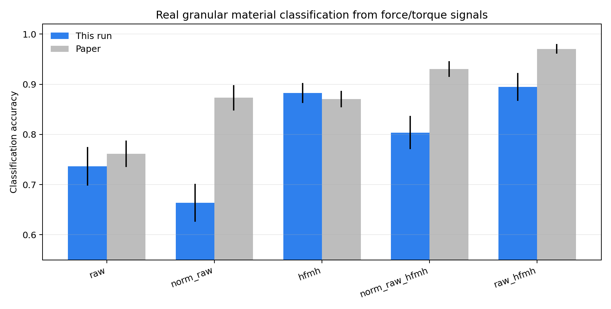
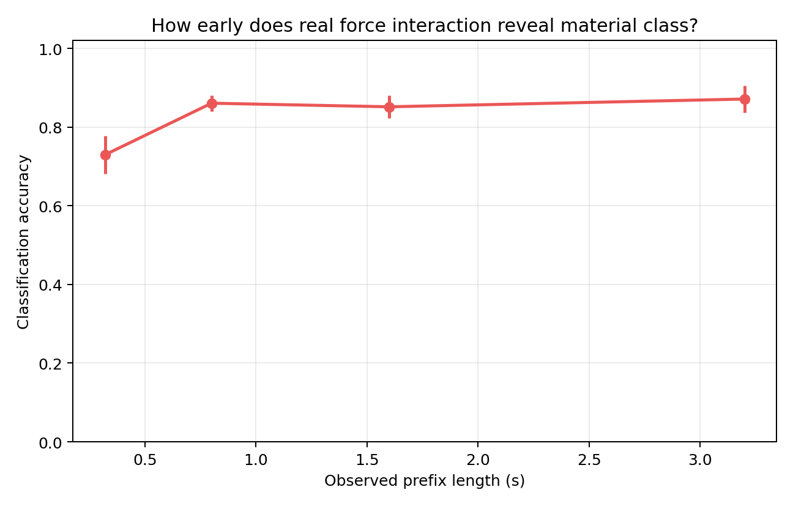
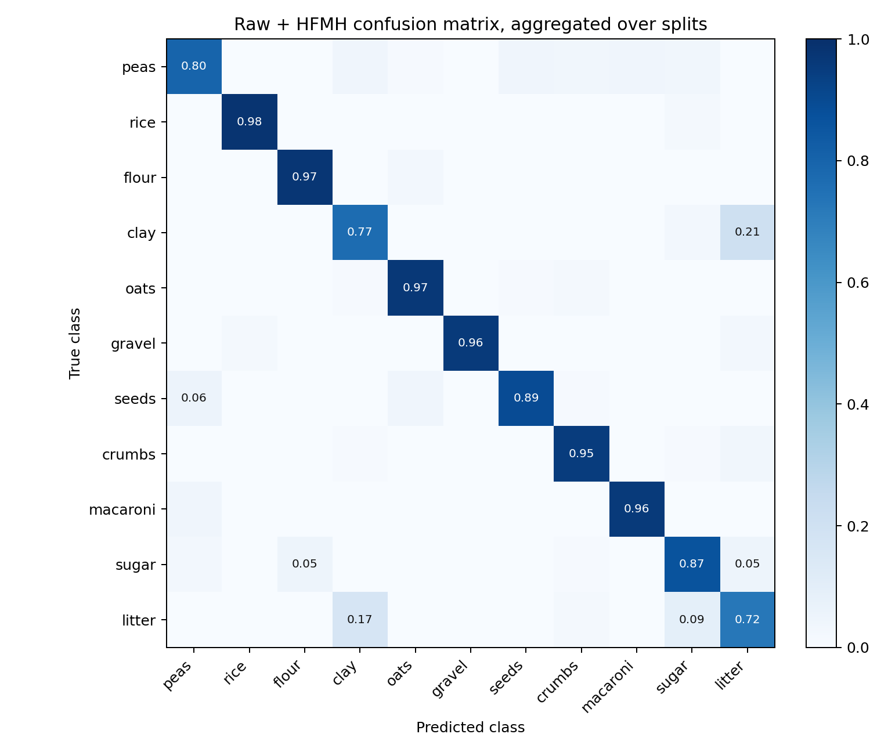

# Aalto Real Force Classification 실험

이 폴더는 `Interactive Identification of Granular Materials using Force Measurements` 논문의 공개 force/torque 데이터셋을 사용해, 실제 로봇 interaction force만으로 granular material class가 식별되는지 확인한 실험을 정리한 것이다.

핵심 결론은 간단하다. 실제 로봇이 입상매질을 직접 훑을 때 나오는 6축 force/torque 신호만으로도 재료 class가 꽤 강하게 분리된다. 특히 전체 3.2초 interaction을 다 보지 않아도, 초반 0.8초 prefix만으로 86.1% classification accuracy가 나온다. 따라서 우리 Sim2Sim 모델이 첫 접촉 이후 빠르게 property posterior를 좁히는 현상은 단순히 synthetic simulator shortcut이라고만 보기 어렵고, 실제 force interaction에도 초반부터 재료 고유 신호가 들어 있다는 근거로 쓸 수 있다.

## 왜 이 실험이 필요한가

우리 연구의 약한 지점 중 하나는 “첫 접촉부터 물성치를 너무 잘 맞히는 것처럼 보인다”는 점이다. 이게 모델이 simulator artifact를 외운 결과인지, 아니면 실제 granular interaction에서도 초반 force dynamics에 재료 정보가 충분히 들어 있는지 분리해서 봐야 한다.

이 실험은 그 질문에 대한 real-data sanity check다. Aalto 논문은 Franka 계열 로봇과 force/torque sensor로 11종 입상매질을 직접 interaction하며 데이터를 수집했고, raw force signal과 고주파 성분을 조합하면 높은 재료 분류 성능이 나온다고 보고했다. 우리는 이 공개 데이터셋에 논문에서 설명한 feature를 적용해, 실제 force signal만으로도 granular class가 식별되는지 확인했다.

이 결과는 우리 논문의 메인 성능 비교가 아니다. DDBot 같은 굴착 시스템과 직접 비교하는 실험도 아니다. 대신 다음 주장을 보강하는 보조 근거다.

> Direct robot-material interaction contains early, material-specific force signatures. This supports online granular property belief estimation from short interaction prefixes.

## 사용 데이터

- 논문: [Interactive Identification of Granular Materials using Force Measurements](https://arxiv.org/html/2403.17606v2)
- 공개 데이터셋: [samhyn/granular_identification](https://github.com/samhyn/granular_identification)
- 재료 수: 11개
- 샘플 수: class당 62개, 총 682개
- 신호: 6축 force/torque
- 길이: 축당 1600 samples
- 샘플링: 500 Hz
- interaction 길이: 3.2초

원본 CSV는 약 166MB라서 이 repo에는 넣지 않았다. `run_experiment.py`를 실행하면 공개 GitHub에서 자동으로 내려받고, `results/data/` 아래에 저장한다. 해당 폴더는 git에서 제외된다.

## 방법

논문에서 제안한 feature를 따른다.

1. 6축 force/torque raw signal을 그대로 flatten한다.
2. 각 축에 대해 8차 Butterworth high-pass filter를 적용한다.
3. cutoff frequency는 23 Hz로 둔다.
4. filtered signal을 `[-1.5, 1.5]` 구간에서 100-bin histogram으로 바꾼다.
5. raw signal 9600차원과 HFMH 600차원을 concat해 `Raw + HFMH` feature를 만든다.
6. class마다 50개 train, 12개 test로 나누고, stratified random split을 10회 반복한다.

논문은 ECOC-SVM classifier를 사용했지만, 공개 repo에는 classification 코드가 포함되어 있지 않다. 여기서는 논문 feature를 그대로 쓰되, 빠르게 재현 가능한 standardized linear hinge-loss classifier를 사용했다. 그래서 이 실험은 official reproduction이 아니라, 논문 설명을 따른 Aalto-style real-data feasibility check로 해석해야 한다.

## 결과

| Feature | 이 실험 accuracy | 논문 reported accuracy |
|---|---:|---:|
| Raw | 73.64% +/- 3.86 | 76.14% +/- 2.65 |
| HFMH | 88.26% +/- 2.00 | 87.05% +/- 1.63 |
| Raw + HFMH | 89.47% +/- 2.80 | 97.05% +/- 0.98 |

`HFMH`와 `Raw + HFMH`가 raw signal보다 확실히 높다. 즉, 단순 force magnitude뿐 아니라 접촉 중 생기는 고주파 진동/마찰 패턴이 재료 구분에 중요하다는 논문 주장과 같은 방향의 결과가 나온다.

Prefix 실험도 같이 했다. `Raw + HFMH` feature를 관측 길이별로 다시 계산했다.

| 관측 길이 | 시간 | Accuracy |
|---:|---:|---:|
| 10% | 0.32초 | 72.95% +/- 4.77 |
| 25% | 0.80초 | 86.06% +/- 2.03 |
| 50% | 1.60초 | 85.15% +/- 2.91 |
| 100% | 3.20초 | 87.12% +/- 3.37 |

이 결과가 특히 중요하다. 실제 F/T 데이터에서도 초반 0.8초만으로 대부분의 재료 class가 구분된다. 우리 모델이 첫 접촉 이후 posterior를 빠르게 좁히는 현상은 물리적으로 말이 되는 방향이다.

## 그림







## 재현 방법

```powershell
python -m pip install -r experiments\aalto_real_force_classification\requirements.txt
python experiments\aalto_real_force_classification\run_experiment.py
```

기본 설정은 현재 커밋된 결과와 맞추기 위해 10 split이다. 논문 설정처럼 20 split을 보고 싶으면 다음처럼 실행한다.

```powershell
python experiments\aalto_real_force_classification\run_experiment.py --splits 20
```

## 우리 연구에 넣을 문장

논문/발표에서는 다음 정도가 안전하다.

> As a real-data sanity check, we applied the Raw+HFMH force representation from prior interactive granular identification work to the public Aalto force/torque dataset. A lightweight linear classifier reaches 89.5% accuracy across 11 real granular materials, and 86.1% accuracy from only the first 0.8 s of interaction. This suggests that early force interaction contains material-specific signatures, supporting our use of short interaction prefixes for online granular property belief estimation.

한국어 발표에서는 이렇게 말하면 된다.

> 실제 로봇 force/torque 데이터셋에서도 초반 interaction force만으로 재료 class가 상당히 잘 구분된다. 따라서 우리 모델이 첫 접촉 이후 빠르게 물성 posterior를 좁히는 현상은 단순히 simulator를 외운 결과라기보다는, 입상매질 interaction 자체에 초반부터 물성 관련 신호가 들어 있기 때문이라고 해석할 수 있다.
